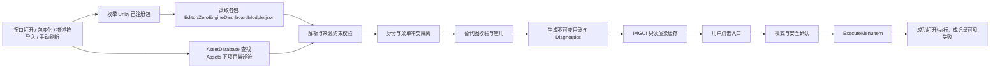

# ZeroEngine 编辑器工具中心与模块自动发现

- 状态：Closed
- 更新日期：2026-08-09
- ZeroEngine 源码基线：`9bb7feedd010287ec35e35e6ce7f40f8563d4458`
- ZeroEngine 实现发布：PR `#17`，merge commit `57dd8473d926d7a3ff05b5ed4c81439f8b815137`
- POB 消费快照：`/main cs:16804`，`Packages/manifest.json` 与 `Packages/packages-lock.json` 同 changeset
- 设计批准：2026-08-09，用户以“干吧”批准本规范
- 执行授权：Authorized，范围为本规范内的本地实现与验证，来源为用户“干吧”
- 终端操作授权：Authorized；范围包括 ZeroEngine commit/push/merge/release、POB Plastic checkin 与任务分支/工作树清理，来源为用户 2026-08-09“收尾”
- 实施状态：Dashboard v2、模块描述符、五路 CI、canonical 发布、POB pin/lock 升级、实机验收和 Plastic 提交均已完成

## 结论

将 `com.zerogamestudio.zeroengine.dashboard` 重做为轻量、可选、只属于 Unity Editor 的工具中心。各模块或消费项目适配器通过自己的 JSON 描述符显式声明可用窗口和命令；Dashboard 从 Unity 已注册包及项目 `Assets` 中自动发现这些描述符，缓存目录，并在用户点击时通过模块现有 `MenuItem` 懒执行。

统一的是发现、导航、命名和失败诊断，不是把各模块窗口嵌入一个巨型窗口，也不是反射扫描所有 `EditorWindow`。Dashboard 不直接引用可选模块、不写 `Packages/manifest.json`、不自动安装包、不在打开时执行模块代码、不承载模块业务逻辑。

## 目标

1. 提供稳定的唯一主入口 `ZeroEngine/Dashboard`，让用户只看到当前项目中已安装且明确接入的模块工具。
2. 安装、移除或升级模块后，无需修改 Dashboard 源码即可更新工具目录。
3. 保持 ZeroEngine 各 UPM 包可独立安装；Dashboard 与任意可选模块之间不得产生编译依赖。
4. 让需要项目配置的通用窗口由项目适配器声明正确入口，避免显示无法独立打开的裸窗口。
5. 统一 ZeroEngine 模块菜单归属和 Dashboard 展示规则，同时保留工具原有窗口、数据、状态及执行语义。
6. 对描述符错误、重复入口、失效菜单和不安全命令提供可见、可定位、互不扩散的诊断。
7. 为现有单体包、模块包及 POB 消费项目提供可回滚的分阶段迁移路线。

## 非目标

- 不重写、合并或嵌入现有模块 `EditorWindow`。
- 不自动枚举所有 `EditorWindow`、`MenuItem` 或第三方插件类型并猜测其用途。
- 不在 Dashboard 内安装、卸载或升级 UPM 包，也不直接编辑消费项目 manifest。
- 不把 POB 专属业务工具上移到 ZeroEngine；项目工具仍由 POB 或 `com.zerogamestudio.pob.*` 拥有。
- 不在本次统一所有 POB 的 `ZGS/*` 菜单；只接入与 ZeroEngine 模块使用直接相关的项目适配入口。
- 不迁移模块窗口内部 UI 技术、持久化状态或业务数据。
- 不把第三方依赖探测器、YooAsset 默认规则或清理存档等项目策略继续放在通用 Dashboard。
- 不为 Dashboard 增加运行时或 Player 构建代码。

## 当前状态与问题

### POB 当前安装面

POB 当前安装 16 个 `com.zerogamestudio.zeroengine.*` 包及 `com.zerogamestudio.analytics`。其中已检查到的编辑器入口如下：

| 所有者 | 当前窗口或命令 | 当前菜单根 | 主要问题 |
| --- | --- | --- | --- |
| Analytics | Analytics Dashboard | `ZGS/Analytics Dashboard` | 属于 ZGS 服务而非 ZeroEngine 模块；当前 Dashboard 使用了错误路径 `ZeroEngine/Analytics Dashboard` |
| Config Pipeline | Config Pipeline Window | `ZGS/Config Pipeline` | ZeroEngine 包使用了 ZGS 根菜单 |
| Data Toolkit | Data Toolkit、Diagnostics | 无通用菜单；由 POB `ZGS/Data Manager` 带 Profile 打开 | 裸窗口不能依据“包已安装”直接展示 |
| Formula | Catalog、Workbench、资产扫描 | `ZeroEngine/Formula/*` | 模块入口基本规范；POB 另有带 Profile 的项目适配入口 |
| Mod System | 创建、导出、校验 | `ZeroEngine/Mod System/*` | 当前窗口只在 `ZEROENGINE_MODSYSTEM_LEGACY` 下编译，不能无条件注册 |
| TCE | Graph Editor、组件目录生成 | `ZGS/ZeroEngine/TCE/*` | 菜单层级重复且与其他模块不一致 |
| Feedback | 安装默认反馈 UI | `ZeroEngine/Feedback/*` | 是写项目资源的命令，不是只读窗口 |
| UI | 安装 Toast System | `ZeroEngine/UI/*` | 是写项目资源的命令，不是只读窗口 |
| POB adapters | POB Dashboard、Data Manager、公式工具、POB 配置器 | `ZGS/*`、`ZGS/工具/POB/*` | 必须保留项目归属，并在聚合时优先于无配置的通用入口 |

当前 POB 没有安装 `com.zerogamestudio.zeroengine.dashboard`。已安装包还分别固定在多个功能分支提交；Dashboard 上线前必须先形成包含所需模块接入描述符的单一测试提交，最终消费不得继续为本功能引入新的跨提交版本分裂。

与本功能有关的当前回滚基线如下；实现开始前若 manifest 已漂移，必须先更新本表和基线日期：

| 包 | 当前远端 | 当前提交 |
| --- | --- | --- |
| `com.zerogamestudio.analytics` | `ZeroGameStudio-CN/zeroengine` | `7afa51fb151448cbfcf99c752d87170e127a73bc` |
| `com.zerogamestudio.zeroengine.core` | `liuzqk/zeroengine` | `d276d8eaffae11e0d43f566bd7554e16df196fe2` |
| `com.zerogamestudio.zeroengine.config-pipeline` | `ZeroGameStudio-CN/zeroengine` | `324d86fe3f0fd2bb0da5a693f199b69263e12f28` |
| `com.zerogamestudio.zeroengine.data` | `liuzqk/zeroengine` | `af4200945faf29dd30b27258b176caf0a0f71df6` |
| `com.zerogamestudio.zeroengine.data-toolkit` | `liuzqk/zeroengine` | `29b45f61b110c32a2b8eae7ed9b13d2feda330cb` |
| `com.zerogamestudio.zeroengine.economy` | `liuzqk/zeroengine` | `c73821ddcef79d330c1a18cec23ddab23363841c` |
| `com.zerogamestudio.zeroengine.extraction` | `liuzqk/zeroengine` | `68fc4d09ff60ab15d9a823fd95811a54611919ca` |
| `com.zerogamestudio.zeroengine.formula` | `ZeroGameStudio-CN/zeroengine` | `350e5b249442ee6ee7192a7bfac02314f00dfd08` |
| `com.zerogamestudio.zeroengine.gameplay` | `liuzqk/zeroengine` | `9449295572e84454531b04b7625a1da047b50935` |
| `com.zerogamestudio.zeroengine.modsystem` | `liuzqk/zeroengine` | `cc6425d9060e77f8ec626c94f271eed56b90ff32` |
| `com.zerogamestudio.zeroengine.narrative` | `liuzqk/zeroengine` | `7609cc940625366cb63ffe146c4cbc4a50731236` |
| `com.zerogamestudio.zeroengine.pathfinding2d` | `liuzqk/zeroengine` | `618548cbb7cb048b573bc65c52a9998bb9ff4223` |
| `com.zerogamestudio.zeroengine.persistence` | `liuzqk/zeroengine` | `c73821ddcef79d330c1a18cec23ddab23363841c` |
| `com.zerogamestudio.zeroengine.tce` | `liuzqk/zeroengine` | `0db83fe5b62597d9a10a89a659d9fc1591c4849c` |
| `com.zerogamestudio.zeroengine.tce.presentation` | `liuzqk/zeroengine` | `0db83fe5b62597d9a10a89a659d9fc1591c4849c` |
| `com.zerogamestudio.zeroengine.feedback` | `ZeroGameStudio-CN/zeroengine` | `7afa51fb151448cbfcf99c752d87170e127a73bc` |
| `com.zerogamestudio.zeroengine.ui` | `ZeroGameStudio-CN/zeroengine` | `7afa51fb151448cbfcf99c752d87170e127a73bc` |

`com.zerogamestudio.unity-mcp-control` 按仓库规则独立固定，不参与 gameplay/runtime 包同提交约束。`com.zerogamestudio.pob.*` 是 POB 自有相对 `file:` 内嵌包，也不属于上游 Git pin 迁移。

### 现有 Dashboard 1.0 的结构性问题

现有包已经声明“根据安装包自动适配”，但实现仍是中央硬编码：

- `ZeroEngineDashboard.cs` 固定绘制模块、插件和工具按钮；新增模块必须修改 Dashboard。
- 多个按钮指向旧单体包菜单，模块化项目中会静默失败。
- Analytics 按钮路径与实际菜单不一致。
- `ZeroEngine.Dashboard.Editor.asmdef` 直接引用 `ZeroEngine.Economy` 和 `ZeroEngine.Persistence`，但 `package.json` 只声明 Core，违背可选模块和 UPM 依赖边界。
- Dashboard 包内直接包含网络包 manifest 写入、PlayerPrefs/存档删除、YooAsset 项目配置和第三方插件探测，混合了导航、环境诊断、项目策略及破坏性操作。
- `EditorApplication.ExecuteMenuItem` 的失败被忽略，用户无法分辨未安装、条件编译关闭、入口改名或执行异常。
- README、程序集引用、菜单路径和真实能力已发生漂移。

### 不能自动扫描所有窗口

Data Toolkit 已证明“存在窗口类型”不等于“存在可直接使用的模块面板”。POB 必须调用 `DataToolkitWindow.Open(POBDataToolkitRegistration.CreateProfile())` 才能得到正确的数据类型、检查器和页脚动作。Formula 与 Config Pipeline 也存在项目 Profile 或项目专属入口。

因此，反射扫描所有 `EditorWindow` 会产生不可用入口、重复入口、测试窗口和内部窗口；扫描 `MenuItem` 也缺少模块名称、说明、排序、安全等级及项目覆盖关系。自动发现必须建立在所有者显式声明之上。

### Unity 2022.3 API 基线

2026-08-09 对开发机 Unity 2022.3.62f3 的 `UnityEditor.dll` 做了只读签名检查，确认：

- `UnityEditor.PackageManager.PackageInfo.GetAllRegisteredPackages()` 为公开静态 API，返回 `PackageInfo[]`；
- `UnityEditor.PackageManager.Events.registeredPackages` 为公开静态事件；
- `UnityEditor.EditorApplication.ExecuteMenuItem(string)` 为公开静态 API，返回 `bool`。

因此，已安装包枚举、包变化通知和菜单执行失败信号不需要内部 Unity API。

## 预期用户行为

1. 用户通过 `ZeroEngine/Dashboard` 打开工具中心。
2. Dashboard 首次打开、脚本域重载、已注册包变化、项目描述符变化或用户点击“刷新”时重建目录；普通 `OnGUI`/`Repaint` 不重新扫描。
3. 左侧显示已接入模块，右侧显示所选模块的可用窗口和命令；顶部搜索可跨模块过滤名称与说明。
4. 只安装模块 A 时只出现 A 的声明；安装模块 B 后无需修改 Dashboard 即出现 B；移除 B 后入口消失。
5. 点击窗口入口时才调用对应菜单并打开原窗口，不预创建所有窗口。
6. 项目适配器声明替代关系时，Dashboard 隐藏被替代的通用入口，只展示项目入口；原菜单本身不被 Dashboard 删除。
7. 菜单不存在、描述符无效或入口冲突时，该入口不执行，Dashboard 的 Diagnostics 显示来源文件及原因，其他模块仍可使用。
8. 写项目资源或破坏性命令必须明确标注并二次确认；命令所有者本身仍必须保留自己的安全检查，不能依赖 Dashboard 作为唯一保护。

## 已确认设计决策

### 1. Dashboard 是可选聚合器

`com.zerogamestudio.zeroengine.dashboard` 只依赖 Unity Editor 内置 API，不依赖 Core、Economy、Persistence、Analytics 或其他 ZeroEngine 包。模块未安装 Dashboard 时继续通过自己的菜单工作。

Dashboard 包版本提升为 `2.0.0`，因为它删除 1.0 的项目写入/清理能力并替换扩展模型；旧单体包对 Dashboard 的依赖同步提升到 `2.0.0`。

旧单体包可继续依赖 Dashboard；模块化消费项目需要显式安装 Dashboard，并与 ZeroEngine 模块固定到同一测试提交。

### 2. 使用声明式 JSON，而不是共享代码接口

每个接入包可在包内放置一个：

`Editor/ZeroEngineDashboardModule.json`

消费项目可在任意 `Assets/**/Editor/` 目录放置同名文件。Dashboard 使用 Unity Package Manager 的已注册包快照查找包描述符，并通过 AssetDatabase 查找项目描述符。

选择 JSON 的原因：

- 不要求模块引用 Dashboard 或新增公共 Editor 契约包。
- 不改变模块的独立安装能力及 Player 程序集。
- 元数据与菜单入口由同一包或同一项目适配器维护，避免中央清单漂移。
- 描述符可在没有模块运行时代码引用的情况下解析、验证和测试。

不采用的方案：

- 中央硬编码：继续制造当前漂移和依赖问题。
- 反射所有窗口或菜单：无法判断可用性、项目 Profile、安全性与所有权。
- 新增共享 Editor 接口包：会让所有独立模块为了可选 Dashboard 增加 UPM 依赖和消费 manifest 负担。

### 3. Dashboard 只导航，不托管模块 UI

入口通过 `EditorApplication.ExecuteMenuItem(menuPath)` 执行。返回失败时显示诊断，不静默吞掉。模块继续拥有：

- 窗口实例、生命周期和布局；
- Profile、项目配置及上下文；
- 资产写入、撤销、确认和错误处理；
- 文档内容及用户可见菜单。

Dashboard 不通过反射构造窗口、不调用私有方法、不把窗口 GUI 嵌入自己的滚动区。

### 4. IMGUI 与缓存目录

Dashboard 2.0 继续使用 IMGUI `EditorWindow`，匹配 Unity 2022.3 与现有实现，且不引入 UI Toolkit 资源和额外包依赖。

窗口结构固定为：

- 顶部：标题、搜索框、刷新按钮、诊断计数，以及 `Tools`、`Installed`、`Diagnostics` 三个页面；
- Tools 左侧：`All` 与按顺序排列、至少含一个可见入口的模块列表；
- Tools 右侧：模块说明、版本、文档入口和工具卡；
- Installed：列出 `com.zerogamestudio.zeroengine*`、`com.zerogamestudio.analytics` 及其他实际提供描述符的已注册包，显示包版本和 Dashboard 接入状态；
- Diagnostics：列出被隔离的描述符、入口冲突和执行失败。

没有描述符的已安装运行时包在 Installed 中显示“未声明工具”，这不是错误，也不会在 Tools 中生成空模块。

有有效描述符但没有可见入口的模块——`entries` 为空、全部入口被隔离或全部被替代隐藏——在 Installed 中显示接入、替代和诊断状态，但不进入 Tools 左侧模块列表。

目录只在明确刷新触发点重建并保存在内存中。`OnGUI` 只读取已验证目录。搜索使用不区分大小写的 Ordinal 匹配；排序依次使用显式 `order`、显示名、稳定 ID。

### 5. 菜单所有权规则

- ZeroEngine 通用模块：`ZeroEngine/<Module>/<Tool>`。
- ZGS 工作室服务 SDK：保留 `ZGS/<Service or Tool>`，例如 Analytics。
- POB 项目适配器：保留 `ZGS/工具/POB/...`、`ZGS/检查/POB/...` 或其他已批准的 POB 根路径。
- Dashboard 可以聚合以上入口，但不得通过改名模糊代码和产品归属。

首版不改任何已有 `MenuItem` 路径。Config Pipeline、TCE、Analytics 和旧单体包均按真实可执行路径接入 Dashboard；统一展示名和分类，不用菜单改名换取表面一致。新入口必须遵守上述规则，现有路径迁移须另行完成全体第一方消费项目调用搜索、兼容设计和主版本发布。

### 6. 项目适配器可替代通用入口

每个工具拥有全限定 ID：`<moduleId>/<entryId>`。任何有效描述符都可在 `replaces` 中列出被替代入口；所有权规范要求该能力只用于通用模块的正式适配或兼容入口，Dashboard 不靠不可验证的“适配包”标签决定资格。

例如 POB Formula 入口可以替代通用 Formula Workbench；POB 配置器可以替代通用 Config Pipeline。替代只影响 Dashboard 目录，不移除原菜单，不改变模块 API。替代目标未安装时仍合法。

目录构建顺序固定为：

1. 解析、来源和字段校验；
2. 检测重复 `moduleId`、全限定入口 ID 和 `menuPath`：`moduleId` 冲突隔离所有同 ID 描述符，入口 ID 或菜单路径冲突只隔离相关入口；
3. 只在第二阶段存活入口间校验 `replaces`：替代环中的全部入口隔离；同一目标存在多个替代者时隔离所有替代者并保留目标；
4. 对剩余替代边应用传递性并集后生成目录：A 替代 B、B 替代 C 时 B 与 C 均隐藏，B 被隐藏不取消其有效替代边。

被隔离入口不能成为有效替代目标。目标 `moduleId` 未安装时悬空替代静默合法；目标模块存在但入口 ID 不存在时产生 Diagnostics 警告但不阻止替代者显示。项目描述符的 `moduleId` 不得等于任何已注册包名；同一 `moduleId` 来自多个描述符时全部隔离。不得依赖扫描顺序决定胜者。

### 7. 安全默认

- 描述符加载和窗口打开不修改项目数据。
- Dashboard 不自动执行任何入口。
- `project-write` 和 `destructive` 命令点击后必须显示描述符提供的确认文本，默认按钮为取消。
- 命令所有者仍必须自行确认、支持 Unity Undo（适用时）、保持 `.meta` 配对并报告写入结果。
- Dashboard 2.0 删除现有网络包自动安装、YooAsset 默认规则、Clear PlayerPrefs 和清理存档入口；这些能力只有在明确的所有者包提供安全菜单后才能通过描述符重新接入。
- 文档外链只允许 `https`，且仅在用户点击后打开。

## 描述符协议 v1

### 示例

```json
{
  "schemaVersion": 1,
  "moduleId": "com.zerogamestudio.zeroengine.formula",
  "displayName": "Formula",
  "description": "公式目录、编辑与治理工具。",
  "order": 300,
  "documentationPath": "README.md",
  "entries": [
    {
      "id": "catalog",
      "displayName": "Formula Catalog",
      "description": "浏览当前公式目录。",
      "category": "authoring",
      "kind": "window",
      "menuPath": "ZeroEngine/Formula/Formula Catalog",
      "order": 100,
      "safety": "navigation",
      "availability": "always",
      "replaces": []
    },
    {
      "id": "scan-assets",
      "displayName": "Scan Formula Assets",
      "description": "扫描项目中的公式资产并输出结果。",
      "category": "diagnostics",
      "kind": "command",
      "menuPath": "ZeroEngine/Formula/Scan Formula Assets",
      "order": 200,
      "safety": "read-only",
      "availability": "edit-mode",
      "replaces": []
    }
  ]
}
```

### 字段规则

| 字段 | 规则 |
| --- | --- |
| `schemaVersion` | 必须为整数 `1`；未知版本拒绝整个描述符并报告诊断 |
| `moduleId` | 必填、全局唯一、ASCII 小写 reverse-DNS 或项目稳定 ID；包描述符必须等于所属 `PackageInfo.name`，项目描述符不得冒用任何已注册包名 |
| `displayName` | 必填、非空；仅用于显示，不作为身份 |
| `description` | 可选 UTF-8 文本；不得包含富文本或可执行内容 |
| `order` | 可选整数；`JsonUtility` 缺失值和显式 `0` 均解释为 `0`，再按显示名与稳定 ID 打破平局；这是可逆的展示默认，第一方描述符应显式填写 |
| `documentationPath` | 可选；包描述符相对 `PackageInfo.resolvedPath`，项目描述符相对描述符所在目录；禁止绝对路径和 `..`，规范化后必须仍位于对应根目录 |
| `documentationUrl` | 可选；只接受 `https` |
| `entries` | 必填数组，可为空；同一模块内 `id` 唯一 |
| `entries[].id` | 必填，小写 kebab-case；与 `moduleId` 组成全限定 ID |
| `category` | 必填枚举：`authoring`、`diagnostics`、`setup`、`documentation` |
| `kind` | 必填枚举：`window` 或 `command` |
| `menuPath` | 必填，必须是无快捷键后缀的完整公开菜单路径 |
| `order` | 可选整数；缺省与显式 `0` 都为 `0`，排序规则同模块；第一方描述符应显式填写 |
| `safety` | 必填枚举：`navigation`、`read-only`、`project-write`、`destructive`；`window` 必须为 `navigation` |
| `confirmation` | `project-write` 和 `destructive` 必填；其他等级不得依赖它改变安全语义 |
| `availability` | 必填枚举：`always`、`edit-mode`、`play-mode`；只约束 Dashboard 按钮，模块仍负责真实前置条件 |
| `replaces` | 可选的全限定入口 ID 数组；只影响 Dashboard 展示 |

`JsonUtility` 足以解析 v1 的定长字段和数组；协议只使用其可区分的默认值，不要求区分缺失整数与显式 `0`，因此 Dashboard 不新增 Newtonsoft.Json 依赖。未知字段由解析器忽略，以允许同一 schema 的向后兼容扩展；缺失、非法或冲突的必需字段由独立校验器拒绝。

`menuPath` 存储 Unity 菜单的规范可执行显示路径，不包含 `MenuItem` 声明中的空格快捷键后缀（`%`、`#`、`&`、`_`）。Unity 2022.3.62f3 实测可能同时接受声明字符串，但协议不依赖该兼容行为；测试程序集必须用无副作用计数菜单验证无后缀路径成功，并验证描述符解析器拒绝带后缀路径。

### 描述符发现与状态流



刷新触发点：

- `ZeroEngineDashboard.OnEnable`；
- Unity Package Manager 已注册包变化事件；
- 只在导入、移动或删除精确文件名 `ZeroEngineDashboardModule.json` 时触发的 AssetPostprocessor；
- 用户点击“刷新”。

不得在静态初始化、每帧 Update、`OnGUI` 或 Repaint 中遍历所有包或 Assets。

### 错误与恢复

- 单个描述符读取或校验失败只隔离该描述符。
- 同一来源的多个错误合并展示；Console 每次目录刷新最多记录一次汇总，避免刷屏。
- 无效入口不显示可执行按钮；Diagnostics 显示来源路径、模块/入口 ID 和可操作原因。
- `ExecuteMenuItem` 返回失败时保留目录，但把该入口标记为“当前不可用”，直到下次刷新；用户可查看实际菜单路径。
- 打开窗口抛出的异常按 Unity 原有 Console 行为保留，同时 Dashboard 增加入口上下文，不吞异常。
- Dashboard 自身没有可迁移的业务数据；关闭并重开即可恢复纯 UI 状态。

## 初始接入范围

### ZeroEngine 上游

| 包 | v2 接入 |
| --- | --- |
| `com.zerogamestudio.zeroengine.dashboard` | 新目录、UI、诊断与执行器；移除模块硬引用和旧项目策略 |
| `com.zerogamestudio.zeroengine` | 为真实存在的历史窗口建立一个包描述符；不批量改旧菜单 |
| `com.zerogamestudio.analytics` | 注册 Analytics Dashboard，保持 ZGS 归属 |
| `com.zerogamestudio.zeroengine.config-pipeline` | 按现有菜单注册配置窗口；首版不改路径 |
| `com.zerogamestudio.zeroengine.formula` | 注册 Catalog、Workbench、扫描命令 |
| `com.zerogamestudio.zeroengine.tce` | 按现有菜单注册 Graph Editor 与目录生成；首版不改路径 |
| `com.zerogamestudio.zeroengine.feedback` | 注册默认 UI 安装命令，安全等级 `project-write` |
| `com.zerogamestudio.zeroengine.ui` | 注册 Toast 安装命令，安全等级 `project-write` |

以下包不伪造入口：

- Data Toolkit 需要项目 Profile；由消费项目适配器注册。
- Mod System 现有窗口属于条件编译 Legacy 程序集；在提供默认始终可用的现代菜单前不注册该入口。
- 纯运行时模块没有 Editor 工具时无需描述符。Dashboard 的“Installed”视图可显示包信息，但不把“未注册工具”视为错误。

### POB 适配

POB 作为首个模块化验收消费者：

- `com.zerogamestudio.pob.formula` 增加描述符，注册 POB Formula Workbench 与 Catalog，并替代对应通用入口。
- POB 项目描述符注册 `ZGS/Data Manager`、`ZGS/工具/POB/配置器` 和 `ZGS/工具/POB 仪表盘`；其中 Data Manager 与配置器分别代表 Data Toolkit 和 Config Pipeline 的项目化入口。
- POB 描述符不复制其余大量项目菜单；这些菜单不属于本次 ZeroEngine 模块统一范围。
- POB 专属名称和菜单路径保持不变。

## 影响范围与文件

### ZeroEngine

修改：

- `com.zerogamestudio.zeroengine.dashboard/package.json`
- `com.zerogamestudio.zeroengine.dashboard/README.md`
- `com.zerogamestudio.zeroengine.dashboard/Editor/ZeroEngine.Dashboard.Editor.asmdef`
- `com.zerogamestudio.zeroengine.dashboard/Editor/ZeroEngineDashboard.cs`
- `com.zerogamestudio.zeroengine/package.json`：把 Dashboard 依赖升级到 `2.0.0`
- 初始接入包的 README 与 `package.json` 版本；首版不改现有菜单源
- `.github/workflows/tests.yml`：必须增加 Dashboard 安装矩阵、Analytics 与 `Tools/Tests/**` 触发，并修正跨 lane Library cache fallback

新增的职责级文件：

- `com.zerogamestudio.zeroengine.dashboard/Editor/Catalog/*`：描述符模型、来源、解析、校验、替代与不可变目录
- `com.zerogamestudio.zeroengine.dashboard/Editor/Execution/*`：可用模式、安全确认和菜单执行
- `com.zerogamestudio.zeroengine.dashboard/Tests/Editor/*`：解析、发现、冲突、替代、安全和窗口目录测试
- `com.zerogamestudio.zeroengine.dashboard/Tests/Editor/ZeroEngine.Dashboard.Tests.Editor.asmdef`
- `Tools/Tests/run-dashboard-editmode-tests.ps1`：在系统临时目录创建最小 Unity 2022.3 消费项目并跑 Dashboard 测试
- 初始接入包各自的 `Editor/ZeroEngineDashboardModule.json`

删除：

- `com.zerogamestudio.zeroengine.dashboard/Editor/PluginManager.cs`
- `com.zerogamestudio.zeroengine.dashboard/Editor/YooAssetSetup.cs`

所有新增、移动和删除的 Unity 包资产必须包含匹配 `.meta`。实现者可调整职责级文件名，但不得改变这里冻结的程序集边界、协议或所有权。

### POB

- `Packages/manifest.json`
- `Packages/packages-lock.json`
- `Packages/com.zerogamestudio.pob.formula/Editor/ZeroEngineDashboardModule.json`
- `Assets/Assets/_Scripts/_POB/Editor/ZeroEngineDashboardModule.json`
- 对应 `.meta`、README 或最窄的 Editor 测试

POB 本次涉及的 ZeroEngine 上游依赖最终只能使用 canonical Git URL + 测试提交哈希；`manifest.json` 与 `packages-lock.json` 必须同一变更提交。上游包的绝对 `file:` 仅允许本地联调，验收前恢复；POB 自有 `com.zerogamestudio.pob.*` 相对 `file:` 包保持不变。

## 程序集与包边界

- Dashboard 的生产程序集仅 `ZeroEngine.Dashboard.Editor`，`includePlatforms` 只含 Editor。
- 该程序集不引用任何 `ZeroEngine.*`、`ZGS.*` 模块程序集；`package.json` 不声明可选模块依赖。
- 测试程序集只引用 Dashboard Editor 与 Unity Test Runner，且仅在 `UNITY_INCLUDE_TESTS` 下编译。
- 描述符是数据，不创建模块到 Dashboard 的程序集引用。
- 模块现有 Editor 程序集继续拥有菜单实现。
- Player 构建不包含 Dashboard 程序集、描述符执行器或项目描述符逻辑。

## 兼容、迁移与回滚

### 兼容

- 现有模块窗口类型、公开菜单路径、公共 API、序列化数据和运行时行为不变。
- Dashboard 只是现有菜单的第二入口；未安装 Dashboard 的项目不受影响。
- POB 项目适配入口优先只影响 Dashboard 展示，不阻止用户直接打开通用菜单。
- 未知 schema 版本明确拒绝，不按 v1 猜测。
- 描述符中的未知非关键字段被忽略，允许同一 schema 的兼容扩展。

### 迁移顺序

1. 先把 POB 使用的全部 `com.zerogamestudio.zeroengine.*` 包目录和本功能修改的 Analytics 整合到 canonical `ZeroGameStudio-CN/zeroengine` 的同一集成提交；包括当前仅从 `liuzqk/zeroengine` 消费的 Data Toolkit、TCE/TCE Presentation、Extraction 等包。无法形成兼容的同提交基线时本功能阻塞，不进入 POB 升级。
2. 在该集成分支实现 Dashboard v2 核心和独立测试；不得基于缺少 POB 当前 Formula、Config Pipeline 或 TCE 代码的旧快照伪造接入。
3. 让 Dashboard 单独安装、没有任何其他 ZeroEngine 模块时先通过编译和空状态测试。
4. 逐包添加描述符和模块级验证；每个包继续可脱离 Dashboard 编译，首版不改已有菜单路径。
5. 为旧单体包生成真实菜单描述符。单体包与对应模块包是互斥消费形态；CI 继续分 lane，manifest/静态验证器拒绝同时安装，不依赖菜单冲突或 Dashboard 能成功编译后再处理该语义。
6. CI 必须执行 `dashboard-only`、`dashboard-with-modules`、`modules-only` 三种冷 Library 安装矩阵；其中模块样本固定包含 Analytics 和 UI（及 UI 所需 Core/TMP），同时保留 legacy 与 modular lanes。
7. 在 POB 本地使用同一 ZeroEngine 工作提交联调项目适配描述符，验证 Profile 路由和替代关系；变更前保存“POB 当前安装面”中的回滚基线表和 manifest/lock 原始字节作为回滚证据。
8. ZeroEngine 形成一个包含 Dashboard 协议与初始模块描述符的测试提交并发布。
9. POB 把全部 `com.zerogamestudio.zeroengine.*` 依赖及本功能修改的 Analytics 切到 canonical 远端的该同一提交，新增 Dashboard，并让 Unity 重新解析 lock；不把上游包的本机绝对 `file:` 路径带入共享变更。

步骤 1–7 及第 9 步的本地改动与验证已由用户授权；ZeroEngine commit/push/release、POB Plastic checkin 及任何外部发布仍需要各自的终端操作授权，当前未请求。

### 回滚

- 上游未发布阶段：恢复本任务拥有的 Dashboard v2、描述符、Analytics 内置模块依赖、CI/测试脚本及机械整合快照差异；保留工作树中所有无关或其他任务拥有的变化，模块运行时数据无迁移。
- 消费项目阶段：按本规范记录的逐包远端与提交集合恢复升级前 `manifest.json` 和 `packages-lock.json` 原始字节；只移除 Dashboard 不能回滚其他包升级。
- POB 回滚验证使用隔离的干净验证副本或既有 CI/构建工作区解析基线 pin 集并完成最窄启动冒烟，不在含设计师待提交配置的主工作区来回切包。
- 本次不改已有菜单路径；如未来独立迁移导致外部 `ExecuteMenuItem` 回归，必须在所有者模块恢复或提供兼容，不得在 Dashboard 新增中央硬编码别名。
- Dashboard 不写业务配置，因此回滚不需要数据转换、清理 Assets 或删除用户数据。

## 生产约束

### 性能与可靠性

- 不在 Editor 每帧或每次重绘扫描包、磁盘或 AssetDatabase。
- 目录刷新必须确定性、可重复；同一输入产生相同排序、替代和诊断结果。
- 一个模块失败不得阻断其他模块，也不得阻止窗口本身打开。
- 描述符读取不得加载模块资产、实例化窗口或触发静态业务初始化。

### 安全与隐私

- 不自动发起网络请求、下载、安装、写 manifest、删除 PlayerPrefs/存档或修改项目资源。
- 外部文档只允许显式点击 `https` 链接。
- Diagnostics 只显示包名、描述符路径、菜单路径和本地校验错误；不得采集或上传项目内容。
- 路径解析必须阻止绝对路径、父目录穿越及描述符根目录逃逸。

### 可用性、辅助与本地化

- 使用标准 Editor 控件，键盘焦点可遍历搜索、模块列表、入口按钮和诊断区。
- 状态同时使用文字和图标，不只依赖颜色。
- 窄窗口使用滚动而不是截断关键按钮；模块或入口为空时显示明确空状态。
- v1 不引入完整本地化框架。描述符与 UI 必须支持 UTF-8；Shell 使用稳定英文术语，模块显示名和说明由所有者提供。多语言字段作为后续 schema 能力，不在 v1 暗中推断。

## 验证方案

### Dashboard 包测试

新脚本 `Tools/Tests/run-dashboard-editmode-tests.ps1` 默认使用当前开发机已验证的 Unity 2022.3.62f3，并允许显式传入 Editor 路径；仓库 CI 继续使用其已配置的 Unity 2022.3.62f1。脚本在系统临时目录创建最小消费项目，至少覆盖三种安装矩阵：

1. 只安装 Dashboard；
2. Dashboard + 两个带描述符的测试模块；
3. 安装模块但不安装 Dashboard。

预期信号：三种项目均无编译错误；第一种显示空状态；第二种只发现两个模块；第三种证明模块没有反向依赖 Dashboard。

EditMode 自动测试覆盖：

- 有效 v1 描述符解析、默认排序和 UTF-8 文本；
- 未知 schema、非法 ID、非法枚举、缺字段、路径穿越与非 HTTPS URL；
- 包描述符 `moduleId` 与包名不一致；
- 全限定 ID、菜单路径冲突与替代循环均 fail closed；
- 重复 `moduleId`、同一目标的多个替代者、替代目标模块存在但入口缺失；
- 项目入口替代通用入口，替代目标缺失仍可用；
- edit/play availability；
- `project-write`、`destructive` 缺确认文本时拒绝；
- 单个坏描述符不影响其他模块；
- `OnGUI` 多次执行不触发重新发现；
- 菜单执行成功、返回 false 和抛异常三条路径的可见状态；
- 无副作用快捷键菜单证明无后缀执行路径可用，解析器同时拒绝带快捷键后缀的描述符路径；
- 生产程序集只在 Editor 编译且不引用可选模块程序集。

### 模块与 CI

- 独立 `Tools/Tests` 扫描器先验证每个初始接入包的描述符路径与所有者源码中的精确 `MenuItem` 声明一致；安装 Dashboard 的 Unity lane 再通过已加载程序集的 `CustomAttributeData` 验证描述符路径确有对应 `MenuItem` attribute。模块自身的生产或测试程序集不得引用 Dashboard。
- 窗口类入口可在 EditMode 打开并关闭；写入型 command 不在自动测试中真正修改生产配置，只验证描述符、安全分级和模块自己的合成/临时数据测试。
- `.github/workflows/tests.yml` 必须显式包含 `com.zerogamestudio.analytics/**` 和 `Tools/Tests/**` 触发路径，并安装 Analytics；cache fallback 使用 `Library-${{ matrix.lane }}-`，不得跨 lane 复用。
- 运行仓库 `Unity Tests` 的 legacy、modular、dashboard-only、dashboard-with-modules、modules-only lanes；五条均以冷 Library 通过才允许发布，实现 closeout 记录一个 workflow run ID 及其五个 job/lane 结果。
- Dashboard 安装矩阵必须实际移除一个模块包并由 Package Manager 事件刷新，证明入口消失；描述符文件增删另测 AssetPostprocessor 路径。
- 对 Config Pipeline、Formula、TCE 等尚位于功能分支的模块，先完成源码整合再跑同一提交的 modular lane。

### POB 验证

所有 Unity 测试按 POB 的 `unity-test-router` 与项目测试规则选择安全路由，不启动竞争 Editor。最窄验证包括：

- `ZeroEngine/Dashboard` 可打开，Console 无编译错误或描述符诊断错误；
- Installed/Tools 中只出现实际已安装并接入的模块；
- POB Formula 点击后打开带 `PobFormulaEditorProfile` 的工作台/目录，而不是无配置通用窗口；
- Data Manager 点击后走 `POBDataToolkitRegistration.CreateProfile()`；
- POB 配置器和 POB Dashboard 分别打开原项目窗口；
- Analytics、TCE、Formula、Feedback、UI 的真实入口可导航或在写入前显示确认；自动验收不执行生产资源写入；
- 合成描述符增删只在系统临时测试项目执行，不在 POB 生产 Assets 中制造再删除测试资产；
- 验证前后保存 POB Plastic scoped status，并对 `Assets/Assets/_Data`、`ProjectSettings` 及受影响工具实际读取的设计配置做临时 SHA-256 清单；除已授权的 manifest/lock、新描述符及其 `.meta` 外无新增任务差异且配置哈希不变；
- `Packages/manifest.json` 中全部 `com.zerogamestudio.zeroengine.*` 及本功能修改的 Analytics 指向 canonical 远端同一发布提交；Unity 解析后 `packages-lock.json` 对应 `revision` 逐包等于该提交，manifest 与 lock 同属任务路径范围，并在获得终端提交授权时进入同一 Plastic changeset；上游依赖不存在本机绝对 `file:`。

人工可见路线：Unity 菜单 `ZeroEngine > Dashboard`。通过信号为模块列表、搜索、项目覆盖、诊断、窗口打开和安全确认均与上述行为一致；关闭 Dashboard 后原菜单仍可直接使用。

## 编号验收标准

1. Dashboard 只依赖 Unity Editor 内置 API，单独安装时无缺失程序集或编译错误。
2. 任意模块未安装 Dashboard 时仍可编译并通过原菜单使用，不存在模块到 Dashboard 的反向依赖。
3. 新增一个有效包描述符后无需修改 Dashboard 源码即可显示该模块；移除包并刷新后入口消失。
4. 只有显式描述符入口可执行；内部、测试或需要 Profile 的裸 `EditorWindow` 不会被自动扫描出来。
5. Dashboard 打开和目录刷新不会实例化或打开任何模块窗口；只有用户点击后执行一次菜单。
6. POB Data Manager、Formula 与 Config Pipeline 均走项目适配入口，不绕过 Profile 或项目配置。
7. 项目适配器的 `replaces` 确定性隐藏通用入口但不删除原菜单；无可见入口的被替代模块只留在 Installed、不进入 Tools；目标模块未安装与目标模块存在但入口缺失分别按协议静默或告警。
8. 重复 moduleId、全限定 ID、菜单路径、多个替代者和替代循环按固定阶段 fail closed，不会按加载顺序任选入口，并显示来源诊断。
9. 未知 schema、非法字段、目录穿越和非 HTTPS 外链被拒绝；其他有效模块继续可用。
10. 失效 `menuPath` 不再静默失败，Dashboard 显示入口、路径及失败状态。
11. 包或项目描述符变化后目录可通过事件或手动刷新更新；普通 `OnGUI`、Update 和 Repaint 不扫描包或 Assets。
12. Dashboard 的自动发现、打开、刷新与 Diagnostics 不发起任何网络请求、下载、安装、manifest 写入、PlayerPrefs/存档删除或项目资源修改；仅用户显式点击已校验的 HTTPS 文档链接，或点击模块入口并通过适用确认后，才进入对应外部 URL 或模块既有执行路径。
13. `project-write` 与 `destructive` 命令缺确认文本时不能注册；执行前默认取消的确认对话框可见。
14. 模块命令自己的 Undo、确认和写入安全不因 Dashboard 接入而削弱。
15. Dashboard 中 Config Pipeline、TCE、Analytics 与 POB 的显示归属一致且可搜索；首版所有已有公开菜单路径保持字节不变。
16. 旧单体包窗口能从 Dashboard 打开，且本次不批量破坏其历史菜单路径。
17. Dashboard 生产 asmdef 只包含 Editor、无运行时程序集引用，描述符位于 Editor 路径且不进入 Resources/Addressables；结构检查证明其不进入 Player 编译输入。
18. 一个描述符失败不会阻断 Dashboard 窗口或其他模块入口，并且同一刷新不重复刷 Console。
19. 搜索、模块选择、入口按钮和诊断可用标准 Editor 键盘焦点操作；状态不只用颜色表示。
20. Dashboard-only、dashboard-with-modules、modules-only 三种冷 Library 安装矩阵在 CI 中全部编译并通过对应 EditMode 测试，且真实包移除事件会删除入口。
21. ZeroEngine legacy、modular 与三种 Dashboard 矩阵均以冷 Library 通过，工作流 cache fallback 为 `Library-${{ matrix.lane }}-` 且无跨 lane 复用；实现 closeout 记录一个 workflow run ID 和五个 job/lane 结果。Analytics 与 UI 被实际安装和触发，初始接入包的描述符路径与已加载公开菜单 attribute 一致。
22. POB 真实菜单路线通过，原菜单仍可直接工作；Plastic 前后状态与临时配置哈希证明自动验收未修改设计师生产配置。
23. POB 全部 `com.zerogamestudio.zeroengine.*` 和本功能修改的 Analytics 使用 canonical 远端同一发布提交，lock 中逐包 `revision` 相同，manifest/lock 同属任务路径范围并在提交获授权时进入同一 changeset；上游依赖无绝对 `file:`，POB 自有相对 `file:` 包保持不变。
24. 升级前逐包远端、哈希与 manifest/lock 原始字节已留作证据；隔离验证路线能恢复该集合并通过最窄启动冒烟，不要求迁移或删除用户业务数据。
25. 所有新增、移动或删除的 Unity 资产均包含匹配 `.meta`。
26. UTF-8 模块名称和说明可正确显示；未知字段兼容、未知 schema 拒绝的行为与协议一致。
27. 单体包与对应模块包被定义为互斥消费形态；manifest/静态验证在编译前拒绝同时安装，不以菜单冲突结果代替。
28. Diagnostics 仅在本地展示允许字段，不采集、持久化或上传项目内容；搜索、刷新、空状态和错误路径均不产生遥测或网络副作用。

## 实施记录（2026-08-09）

### As-built

- `com.zerogamestudio.zeroengine.dashboard` 已升级为 `2.0.0`：生产程序集仅 Editor、无可选模块引用；目录从已注册 UPM 包及项目 `Assets/**/Editor/ZeroEngineDashboardModule.json` 发现描述符，并缓存到显式刷新事件。
- 已实现 v1 描述符解析、来源所有权、确定性排序、冲突隔离、替代关系、可用模式、安全确认、菜单执行结果、Installed/Tools/Diagnostics 三个视图，以及包变化和精确描述符 AssetPostprocessor 刷新。
- 已移除旧 Dashboard 的中央插件硬引用、包安装逻辑和 YooAsset 项目策略；模块窗口仍由原包和原菜单拥有。
- 已为单体包、Analytics、Config Pipeline、Formula、TCE、Feedback、UI 增加 7 个上游描述符；为真实 Package Manager 移除事件增加无代码测试夹具。
- 已将 POB 当前消费的 ZeroEngine 包快照机械整合到同一上游工作树，并为 POB Formula 与项目 Editor 增加适配描述符。POB 五个入口均匹配现有 `MenuItem`；Data Manager、Formula 和 Config Pipeline 仍调用原项目 Profile/适配实现。
- `.github/workflows/tests.yml` 已形成 legacy、modular、dashboard-only、dashboard-with-modules、modules-only 五 lane 冷 Library 矩阵；静态门验证描述符与所有者源码菜单声明、包边界、模块到 Dashboard 的反向依赖和 legacy/modular 互斥，Unity 测试负责验证已加载的真实菜单 attribute。
- 冷编译发现 Analytics 实际使用 UnityWebRequest 与 ImageConversion 内置模块，已把 `com.unity.modules.unitywebrequest` 和 `com.unity.modules.imageconversion` 声明为 Analytics 依赖，并同步本地测试与 CI manifest。
- Unity 2022.3.62f3 实测 `EditorApplication.ExecuteMenuItem` 也接受含快捷键声明的 attribute 字符串。协议仍统一存储和执行无后缀显示路径，解析器拒绝快捷键后缀；真实无后缀执行测试通过，不再把“带后缀一定返回 false”作为 Unity 行为假设。

### 验证证据

- Unity 2022.3.62f3、`unity-test-router` one-shot batch，测试过滤器 `ZeroEngine.Dashboard.Tests.Editor.DashboardCatalogTests`：Dashboard-only run `20260809-105849-41388` 为 `34 passed / 1 environment-gated skipped / 0 failed`，`results.xml` SHA-256 `d00c41e34a8c294ec2ddd613a615cec33ea21ef07b27d1667a904cb7d78e3334`；Dashboard + Core + UI + Analytics + 移除夹具 run `20260809-110125-182360` 为 `35/35`，`results.xml` SHA-256 `7781312eb906ed204239188130ba38f3bbebb69b813d2c5a5a8448efc3c08ce8`。后者包含真实 `Client.Remove`、窗口订阅的 `registeredPackages` 刷新和目录入口消失断言；两条最终日志均为 `compileErrors=0, infrastructureErrors=0`，日志 SHA-256 分别为 `fdeaf1042d13c44500767e28e0aa30adb0a77efa28404d9c5a98c58c964dd98e`、`50ebf7474ffadf6c80e713889baa0c66d9107fdfa76a8cca064a81cb5b007332`。原始 XML 与日志稳定保存在 `D:/unity/artifacts/zeroengine-dashboard-unification/20260809-local-verification/`。
- 静态描述符门：`PASS Dashboard descriptors=7`，验证所有者源码中的精确菜单声明；Unity 测试另以已加载程序集的 `CustomAttributeData` 验证真实 `MenuItem` attribute。工作流 YAML 可解析；测试脚本 PowerShell AST 可解析；双审发现并修复矩阵脚本读取陈旧 `$LASTEXITCODE` 以及漏判 Unity 非零退出码的控制流问题。
- 独立双审终局复核均为 `PASS`：实现审查确认确认框关闭/Esc 不再执行、窗口订阅真实刷新已覆盖、Unity 非零退出码阻断 PASS；规范审查确认授权、静态/已加载菜单证据边界和稳定验证产物记录一致，无残留 Critical/Important。
- `git diff --check` 通过；新增与删除 Unity 资产配对检查为 `new=360, deleted=6`，无缺失 `.meta`。数量包含为统一同一提交基线而整合的 POB 当前消费快照。
- GitHub Actions `Unity Tests` run `31311732684` 在同一提交 `6863b8ae7823f4cecfbcb648574ff5a8f0552a5c` 上全部通过：modules-only job `93240459084`、modular job `93240459097`、dashboard-only job `93240459119`、dashboard-with-modules job `93240459129`、legacy job `93240459130`；实现由 PR `#17` 合并为 `57dd8473d926d7a3ff05b5ed4c81439f8b815137`。
- POB 两个描述符由 PowerShell `ConvertFrom-Json` 解析通过；五个 `menuPath` 以精确 `[MenuItem("<path>"` 字符串逐项匹配所有者源码，两个新 GUID 以 `rg --glob '*.meta' '^guid: (...)$'` 验证各唯一命中一次。`ZeroEngine/Dashboard` 与五个 POB adapter 菜单均在 Unity 2022.3.62f3 的项目租约内真实执行成功；最终 Console 为 `0 error`。
- POB manifest 与 lock 中 17 个 `com.zerogamestudio.zeroengine.*` 包及 Analytics 共 18 个直接 Git 依赖均指向 canonical URL 和 `57dd8473d926d7a3ff05b5ed4c81439f8b815137`；`com.zerogamestudio.unity-mcp-control` 按独立 pin 保持不变，POB 自有相对 `file:` 包保持不变。生产配置 `Assets/Assets/_Data` 与 `ProjectSettings` 共 19,758 个文件的前后哈希清单一致，清单 SHA-256 均为 `82b2914dddef94fa10887fbf7886cfa9d90650864f81ab82aed72422c8bfd1cf`；回滚与哈希证据保存在 `D:/unity/artifacts/zeroengine-dashboard-unification/pob-upgrade-57dd847/`。
- 隔离 Unity 项目、测试结果目录、整合 patch 与快照等任务临时物已移出系统临时目录并送入回收站；未删除或覆盖工作区文件。

### 发布收口

- POB Plastic `cs:16804` 的 changeset XML 复核实际只含 manifest、lock、两个 adapter JSON 与两个 `.meta`；提交后六个目标路径全部 CLEAN，其他 pending 未纳入。
- Plastic 提交前 helper dry-run 为 `Selected file count: 6`、`Ignored path count: 0`；提交后的 workspace coordination 为 `claims=0`、`tasks=0`、`unity-active=false`。
- 本功能是内部 Editor/CI 工具，自动化矩阵、双审与 POB 实机菜单路线已完整覆盖，不需要主观人工验收卡；按 acceptance ledger 规则跳过建卡。
- 验收标准 1–28 已满足，规范关闭；后续菜单路径迁移、新模块描述符或 Dashboard 协议升级作为独立工作项处理。

## 停止条件与剩余风险

实现期间出现以下情况必须停止扩展并回到设计或请求授权：

- Unity 2022.3 公开 API 无法可靠枚举已注册包或判断菜单执行结果，导致必须依赖内部 API；
- 模块需要在 Dashboard 内嵌自定义 GUI 才能满足需求；
- 为可选接入必须新增模块到 Dashboard 的编译依赖；
- POB 所需模块尚未整合到可形成同一测试提交的上游基线；
- 任一模块必须改动已有公开菜单路径才能接入，且无法保持兼容；
- 验证会修改设计师生产配置或需要启动竞争 Unity Editor。

已知可接受风险是 JSON 菜单路径仍属于字符串契约。该风险通过所有者同包维护、自动校验、失败诊断和项目覆盖机制控制；相比中央硬编码，它把漂移影响限制在单个模块，并保持 UPM 解耦。
